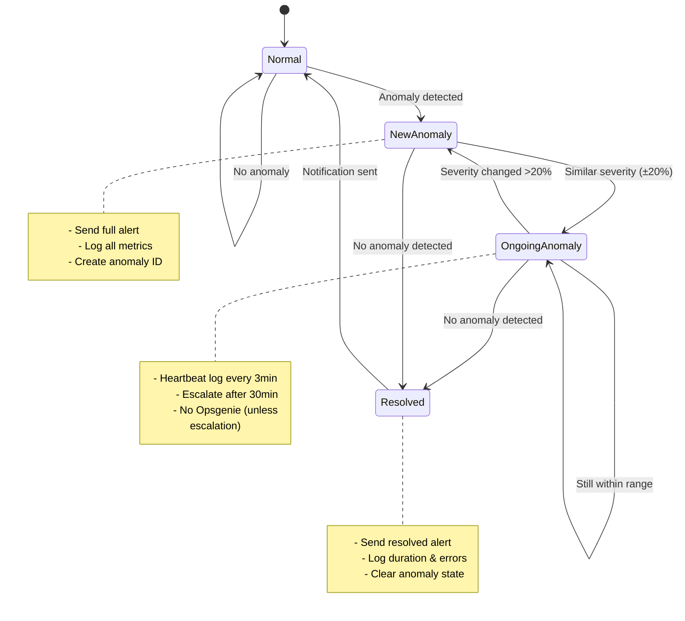
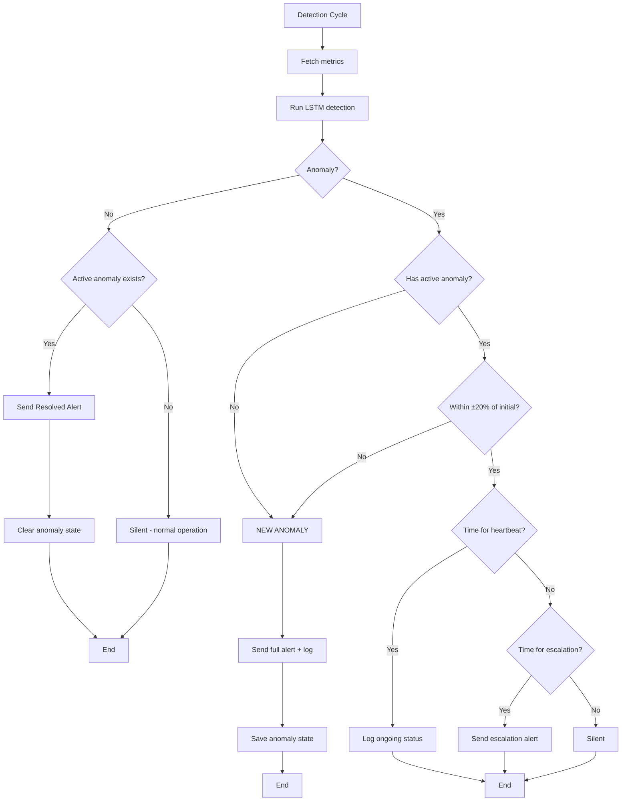

# Alert Deduplication Implementation Plan

## Architecture Overview

The system will track anomaly state across detection cycles and intelligently decide when to alert, log, or stay silent based on anomaly severity changes.




## Detection Flow




## Implementation Details

### 1. State Management ([scripts/inference.py](scripts/inference.py))

**Add new instance variables** in `__init__` method (after line 96):

```python
# Anomaly deduplication state
self.current_anomaly_id = None           # UUID of ongoing anomaly
self.anomaly_start_time = None           # When anomaly first detected
self.anomaly_initial_error = None        # Initial reconstruction error
self.last_heartbeat_log_time = None      # Last heartbeat log time
self.last_escalation_time = None         # Last escalation alert time

# Deduplication config (loaded from YAML)
self.dedup_enabled = None
self.severity_tolerance = None           # ±20% by default
self.heartbeat_interval = None           # 180 seconds
self.escalation_threshold = None         # 30 minutes
self.escalation_interval = None          # 15 minutes
self.send_resolved = None
```

**Load configuration** in `_initialize_components` (after line 107):

```python
# Alert deduplication config
self.dedup_enabled = self.config.get('alerting.rate_limiting.enable_deduplication', True)
self.severity_tolerance = self.config.get('alerting.rate_limiting.severity_tolerance', 0.2)
self.heartbeat_interval = self.config.get('alerting.rate_limiting.heartbeat_interval_seconds', 180)
self.escalation_threshold = self.config.get('alerting.rate_limiting.escalation_threshold_minutes', 30)
self.escalation_interval = self.config.get('alerting.rate_limiting.escalation_interval_minutes', 15)
self.send_resolved = self.config.get('alerting.rate_limiting.send_resolved_notification', True)
```

### 2. Core Deduplication Logic ([scripts/inference.py](scripts/inference.py))

**New method: Severity matching**

```python
def _is_same_anomaly(self, current_error: float) -> bool:
    """Check if current anomaly matches severity of ongoing anomaly (±20%)"""
    if self.anomaly_initial_error is None:
        return False
    
    tolerance = self.severity_tolerance
    lower_bound = self.anomaly_initial_error * (1 - tolerance)
    upper_bound = self.anomaly_initial_error * (1 + tolerance)
    
    return lower_bound <= current_error <= upper_bound
```

**New method: Heartbeat check**

```python
def _should_send_heartbeat(self) -> bool:
    """Check if it's time for heartbeat log"""
    if not self.dedup_enabled or self.last_heartbeat_log_time is None:
        return True  # First heartbeat
    
    elapsed = (datetime.now() - self.last_heartbeat_log_time).total_seconds()
    return elapsed >= self.heartbeat_interval
```

**New method: Escalation check**

```python
def _should_escalate(self) -> bool:
    """Check if anomaly has lasted long enough to escalate"""
    if self.anomaly_start_time is None:
        return False
    
    duration_minutes = (datetime.now() - self.anomaly_start_time).total_seconds() / 60
    
    # First escalation at threshold
    if duration_minutes >= self.escalation_threshold:
        # Check if we've escalated before
        if self.last_escalation_time is None:
            return True
        
        # Subsequent escalations at interval
        time_since_last = (datetime.now() - self.last_escalation_time).total_seconds() / 60
        return time_since_last >= self.escalation_interval
    
    return False
```

### 3. Notification Methods ([scripts/inference.py](scripts/inference.py))

**New method: Heartbeat log**

```python
def _send_heartbeat_log(self, detection_result: dict):
    """Log ongoing anomaly status"""
    duration = int((datetime.now() - self.anomaly_start_time).total_seconds())
    duration_str = f"{duration//60}m {duration%60}s"
    
    current_error = detection_result['reconstruction_error']
    initial_error = self.anomaly_initial_error
    
    self.logger.info(f"⏱️ Anomaly ongoing for {duration_str}")
    self.logger.info(f"   Current error: {current_error:.4f} (initial: {initial_error:.4f})")
    self.logger.info(f"   Anomaly ID: {self.current_anomaly_id}")
    
    self.last_heartbeat_log_time = datetime.now()
```

**New method: Escalation alert**

```python
def _send_escalation_alert(self, detection_result: dict):
    """Send escalation alert for long-running anomaly"""
    duration = int((datetime.now() - self.anomaly_start_time).total_seconds() / 60)
    
    self.logger.warning(f"⚠️ ESCALATION: Anomaly ongoing for {duration} minutes")
    self.logger.warning(f"   Anomaly ID: {self.current_anomaly_id}")
    self.logger.warning(f"   Current error: {detection_result['reconstruction_error']:.4f}")
    self.logger.warning(f"   Initial error: {self.anomaly_initial_error:.4f}")
    
    # Send to Opsgenie if configured
    if self.opsgenie_client:
        # Modify detection result to indicate escalation
        escalation_result = detection_result.copy()
        escalation_result['is_escalation'] = True
        escalation_result['duration_minutes'] = duration
        escalation_result['initial_error'] = self.anomaly_initial_error
        
        grafana_link = None
        if self.grafana_links:
            grafana_link = self.grafana_links.generate_anomaly_link(detection_result['timestamp'])
        
        result = self.opsgenie_client.create_alert(escalation_result, grafana_link)
        if result['status'] == 'success':
            self.logger.info(f"Escalation alert sent to Opsgenie: {result['alert_id']}")
        
    self.last_escalation_time = datetime.now()
```

**New method: Resolved notification**

```python
def _send_resolved_notification(self):
    """Send notification when anomaly resolves"""
    if not self.send_resolved or self.anomaly_start_time is None:
        return
    
    duration = int((datetime.now() - self.anomaly_start_time).total_seconds())
    duration_str = f"{duration//60}m {duration%60}s"
    
    self.logger.warning(f"✅ RESOLVED: Anomaly cleared after {duration_str}")
    self.logger.warning(f"   Anomaly ID: {self.current_anomaly_id}")
    self.logger.warning(f"   Initial error: {self.anomaly_initial_error:.4f}")
    
    # Send to Opsgenie if configured
    if self.opsgenie_client:
        # Create resolved alert payload
        resolved_payload = {
            'is_anomaly': False,
            'is_resolved': True,
            'anomaly_id': self.current_anomaly_id,
            'duration_seconds': duration,
            'initial_error': self.anomaly_initial_error,
            'timestamp': datetime.now().isoformat()
        }
        
        result = self.opsgenie_client.create_resolved_alert(resolved_payload)
        if result['status'] == 'success':
            self.logger.info(f"Resolved notification sent to Opsgenie")
```

### 4. Update Main Detection Loop ([scripts/inference.py](scripts/inference.py))

**Replace current detection logic** in `run_detection_cycle` (lines 285-290):

```python
detection_result = self.detector.detect(current_data)
is_anomaly = detection_result.get('is_anomaly', False)
reconstruction_error = detection_result['reconstruction_error']

if not self.dedup_enabled:
    # Legacy behavior - no deduplication
    if is_anomaly:
        self._log_anomaly_metrics(current_data)
        self._send_alert(detection_result)
    else:
        self.logger.debug(f"Normal operation - reconstruction error: {reconstruction_error:.4f}")
else:
    # Deduplication logic
    if is_anomaly:
        # Check if this is a new or ongoing anomaly
        if self.current_anomaly_id is None:
            # NEW ANOMALY - first detection
            self.current_anomaly_id = str(uuid.uuid4())
            self.anomaly_start_time = datetime.now()
            self.anomaly_initial_error = reconstruction_error
            self.last_heartbeat_log_time = datetime.now()
            self.last_escalation_time = None
            
            # Full alert
            self.logger.warning("🚨 NEW ANOMALY DETECTED")
            self._log_anomaly_metrics(current_data)
            self._send_alert(detection_result)
            
        elif not self._is_same_anomaly(reconstruction_error):
            # DIFFERENT ANOMALY - severity changed significantly
            old_id = self.current_anomaly_id
            old_duration = int((datetime.now() - self.anomaly_start_time).total_seconds() / 60)
            
            self.logger.warning(f"🔄 NEW ANOMALY (severity changed, previous lasted {old_duration}m)")
            
            # Reset state for new anomaly
            self.current_anomaly_id = str(uuid.uuid4())
            self.anomaly_start_time = datetime.now()
            self.anomaly_initial_error = reconstruction_error
            self.last_heartbeat_log_time = datetime.now()
            self.last_escalation_time = None
            
            # Full alert for new anomaly
            self._log_anomaly_metrics(current_data)
            self._send_alert(detection_result)
            
        else:
            # ONGOING ANOMALY - same severity
            if self._should_escalate():
                self._send_escalation_alert(detection_result)
            elif self._should_send_heartbeat():
                self._send_heartbeat_log(detection_result)
            # else: silent (deduplication working)
            
    else:
        # No anomaly detected
        if self.current_anomaly_id is not None:
            # Anomaly just resolved
            self._send_resolved_notification()
            
            # Clear state
            self.current_anomaly_id = None
            self.anomaly_start_time = None
            self.anomaly_initial_error = None
            self.last_heartbeat_log_time = None
            self.last_escalation_time = None
        else:
            # Normal operation
            self.logger.debug(f"Normal operation - reconstruction error: {reconstruction_error:.4f}")
```

### 5. Opsgenie Client Updates ([src/alerting/opsgenie_client.py](src/alerting/opsgenie_client.py))

**Add escalation support** to `create_alert` method (update line 43-47):

```python
if detection_result.get('is_escalation', False):
    duration = detection_result.get('duration_minutes', 0)
    alert_payload['message'] = f'⚠️ ESCALATION: TV-over-IP Anomaly ongoing for {duration} minutes'
    alert_payload['tags'].append('escalation')
    alert_payload['priority'] = 'P2'  # Bump priority
```

**Add new method for resolved alerts**:

```python
def create_resolved_alert(self, resolved_data: Dict) -> Dict:
    """Create resolved notification in Opsgenie"""
    duration = resolved_data.get('duration_seconds', 0)
    duration_str = f"{duration//60}m {duration%60}s"
    
    description = f"""
Anomalía resuelta en servicio TV-over-IP

✅ Estado: Resuelto
⏱️ Duración: {duration_str}
🆔 Anomaly ID: {resolved_data.get('anomaly_id', 'N/A')}
📊 Error inicial: {resolved_data.get('initial_error', 0):.4f}
    """.strip()
    
    alert_payload = {
        'message': '✅ Anomalía resuelta en TV-over-IP',
        'description': description,
        'priority': 'P5',
        'tags': ['anomaly-detection', 'tv-over-ip', 'resolved'],
        'details': {
            'status': 'resolved',
            'duration_seconds': duration,
            'initial_error': resolved_data.get('initial_error'),
            'anomaly_id': resolved_data.get('anomaly_id'),
            'resolved_at': resolved_data.get('timestamp')
        }
    }
    
    try:
        response = requests.post(
            f"{self.base_url}/v2/alerts",
            headers=self.headers,
            data=json.dumps(alert_payload),
            timeout=10
        )
        response.raise_for_status()
        
        return {
            'status': 'success',
            'alert_id': response.json().get('requestId')
        }
    except requests.exceptions.RequestException as e:
        return {
            'status': 'error',
            'error': str(e)
        }
```

### 6. Configuration Updates ([config/alerting.yaml](config/alerting.yaml))

**Replace rate_limiting section** (lines 24-27):

```yaml
rate_limiting:
  min_interval_seconds: 300                      # Min time between Opsgenie alerts (same anomaly)
  max_alerts_per_hour: 10                        # Not yet implemented (future)
  enable_deduplication: true                     # Enable smart anomaly tracking
  severity_tolerance: 0.2                        # ±20% for same anomaly detection
  heartbeat_interval_seconds: 180                # Log ongoing status every 3 minutes
  send_resolved_notification: true               # Send alert when anomaly clears
  escalation_threshold_minutes: 30               # Re-alert if anomaly persists 30+ minutes
  escalation_interval_minutes: 15                # Re-alert every 15 minutes after first escalation
```

### 7. Add Import ([scripts/inference.py](scripts/inference.py))

**Add uuid import** at top of file (after line 40):

```python
import uuid
```

## Testing Strategy

1. **Test new anomaly detection**: Inject anomaly, verify full alert sent
2. **Test ongoing detection**: Let anomaly run 5 minutes, verify only heartbeat logs
3. **Test severity change**: Inject different anomaly type, verify new alert
4. **Test escalation**: Let anomaly run 30+ minutes, verify escalation alert
5. **Test resolution**: Clear anomaly, verify resolved notification
6. **Test disable deduplication**: Set `enable_deduplication: false`, verify legacy behavior

## Configuration Summary


| Setting                        | Default | Purpose                    |
| ------------------------------ | ------- | -------------------------- |
| `enable_deduplication`         | `true`  | Master switch              |
| `severity_tolerance`           | `0.2`   | ±20% matching threshold    |
| `heartbeat_interval_seconds`   | `180`   | Log every 3 minutes        |
| `escalation_threshold_minutes` | `30`    | First escalation after 30m |
| `escalation_interval_minutes`  | `15`    | Re-escalate every 15m      |
| `send_resolved_notification`   | `true`  | Alert on resolution        |


## Expected Behavior Examples

### Scenario 1: 45-minute anomaly

```
0:00  - 🚨 NEW ANOMALY (full alert to Opsgenie)
0:30  - [silent]
1:00  - [silent]
1:30  - [silent]
2:00  - [silent]
2:30  - [silent]
3:00  - ⏱️ Heartbeat log (INFO)
3:30  - [silent]
...
30:00 - ⚠️ ESCALATION (alert to Opsgenie)
33:00 - ⏱️ Heartbeat log
36:00 - ⏱️ Heartbeat log
...
45:00 - ⚠️ ESCALATION (2nd escalation)
45:30 - ✅ RESOLVED (alert to Opsgenie)
```

### Scenario 2: Severity change

```
0:00  - 🚨 NEW ANOMALY (error: 2.0)
3:00  - ⏱️ Heartbeat (error: 2.1 - still within ±20%)
6:00  - ⏱️ Heartbeat (error: 2.2)
9:00  - 🔄 NEW ANOMALY (error: 3.5 - >20% change)
12:00 - ⏱️ Heartbeat (error: 3.4)
15:00 - ✅ RESOLVED
```

