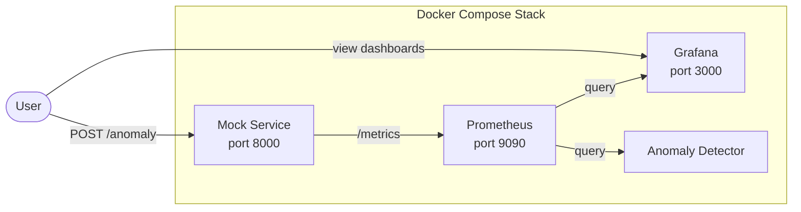

# Mock Metrics Service with Prometheus and Grafana Integration

## Architecture




## Files to Create

### 1. Mock Service - [mock_service/app.py](mock_service/app.py)

Python service using `prometheus_client` that:

- Exposes metrics matching [config/data.yaml](config/data.yaml) queries:
  - `http_requests_total` (Counter)
  - `http_request_duration_seconds` (Histogram)
  - `http_request_errors_total` (Counter)
  - `process_resident_memory_bytes` (Gauge)
  - `process_cpu_seconds_total` (Counter)
  - `up` (Gauge)
- Simulates realistic daily traffic patterns (higher load during day)
- Provides API endpoints:
  - `GET /health` - health check
  - `POST /anomaly` - trigger anomaly injection (accepts type: `latency_spike`, `error_burst`, `memory_spike`, `traffic_drop`)

### 2. Mock Service Dockerfile - [mock_service/Dockerfile](mock_service/Dockerfile)

Lightweight Python container for the mock service.

### 3. Mock Service Requirements - [mock_service/requirements.txt](mock_service/requirements.txt)

Dependencies: `prometheus_client`, `flask`

### 4. Prometheus Config - [prometheus.yml](prometheus.yml)

Configure Prometheus to scrape:

- Mock service at `mock-service:8000` (15s interval)
- Self-monitoring at `localhost:9090`

### 5. Grafana Provisioning

**Datasource** - [grafana/provisioning/datasources/prometheus.yml](grafana/provisioning/datasources/prometheus.yml)

- Auto-configure Prometheus as default datasource at `http://prometheus:9090`

**Dashboard** - [grafana/provisioning/dashboards/dashboard.yml](grafana/provisioning/dashboards/dashboard.yml) + [grafana/dashboards/tv-metrics.json](grafana/dashboards/tv-metrics.json)

- Pre-built dashboard showing all 6 metrics with time series panels

## Files to Modify

### 6. Docker Compose - [docker-compose.yml](docker-compose.yml)

Add:

- `mock-service` container (same `dev` profile as Prometheus/Grafana)
- Volume mounts for Grafana provisioning
- Volume mount for Grafana dashboards

## Dependency Update

### 7. Requirements - [requirements.yml](requirements.yml)

Add `prometheus_client` to pip dependencies (for local development if needed).

## Usage

```bash
# Start the full dev stack
docker-compose --profile dev up -d

# View metrics in Grafana
open http://localhost:3000  # admin/admin

# Trigger an anomaly
curl -X POST http://localhost:8000/anomaly -d '{"type": "latency_spike", "duration": 300}'
```

