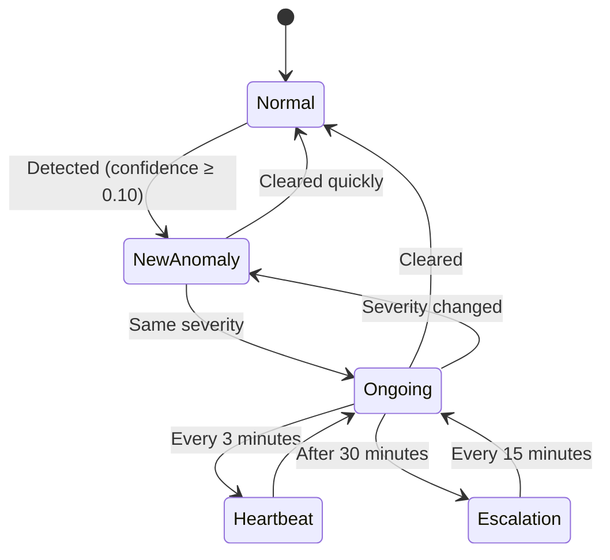

# LSTM Autoencoder Anomaly Detection - Troubleshooting Journal
**Date:** February 6, 2026  
**Session:** Debugging False Positive Anomaly Detections

---

## Timeline of Issues and Resolutions

### Issue #1: Continuous False Positive Detections
**Time:** ~20:20 UTC  
**Symptom:** System detecting anomalies every 30 seconds despite no active anomalies and normal-looking metrics

**Investigation:**
- Checked logs: reconstruction errors consistently ~0.75-0.79
- Threshold was only 0.4730
- Metrics appeared normal:
  - latency_p95: 0.957s
  - error_rate: 1.22
  - request_rate: 61.09
- Compared with Grafana dashboard showing p95 latency at 239ms

**Initial Hypothesis:** Model trained on synthetic data producing higher reconstruction errors on real data

---

### Issue #2: Latency Value Mismatch (ROOT CAUSE)
**Time:** ~20:30 UTC  
**Symptom:** Anomaly detector showing latency_p95 = 0.957s, but Grafana showing 239ms (4x difference!)

**Investigation:**
- Examined mock service code: generates latency 10-200ms
- Examined synthetic data: generates latency 300-1500ms
- **Critical Discovery:** Grafana showed p95 = 239ms, but detector showed 957ms = 239ms × 4

**Root Cause Identified:**
- `PrometheusClient._parse_prometheus_response()` was **SUMMING** values across multiple time series
- The p95 latency query returned 4 separate time series (one per endpoint: /stream, /api/channels, /api/epg, /health)
- Code was summing: 240ms + 240ms + 240ms + 240ms = 960ms ❌
- Should have been using MAX or MEAN for latency metrics ✅

---

### Fix #1: Prometheus Aggregation Method
**Time:** ~20:35 UTC  
**Action Taken:**
- Modified `src/data/prometheus_client.py`:
  - Added `aggregation` parameter to `query_range()` and `_parse_prometheus_response()`
  - Implemented three aggregation methods: 'sum', 'mean', 'max'
  - Configured appropriate aggregation per metric:
    - `latency_p95`: MAX (worst-case across endpoints)
    - `memory_usage`: MEAN (average)
    - `request_rate`, `error_rate`, `cpu_usage`: SUM (totals)

**Result:** Latency values now correctly showing ~0.238s, matching Grafana ✅

---

### Issue #3: Continued False Positives After Fix
**Time:** ~21:09 UTC  
**Symptom:** Even with correct latency values, reconstruction errors (0.99) still exceeded threshold (0.4429)

**Investigation:**
- Model was trained on synthetic data with different patterns than real traffic
- Only 6 hours of real Prometheus data available (insufficient for training)
- Synthetic data patterns didn't match observed reality

---

### Fix #2: Updated Synthetic Training Data
**Time:** ~21:13 UTC  
**Action Taken:**
- Updated `scripts/train.py` with synthetic data matching ACTUAL observed patterns:
  - `request_rate`: 25-75 req/s (was 50-150)
  - `latency_p95`: 0.18-0.30s (was 0.3-1.5s)
  - `memory_usage`: 0.5-0.8GB (was 1-1.5GB)
  - `error_rate`: 0.5-1.5 errors/s (was 1-3)
  - `cpu_usage`: 0.04-0.07 (was 0.05-0.20)
- Retrained model with 168 hours (7 days) of corrected synthetic data

**Result:** New threshold: 0.5458 (still too low)

---

### Issue #4: Reconstruction Errors Still Too High
**Time:** ~21:15 UTC  
**Symptom:** Normal traffic producing reconstruction errors ~0.99-1.0, threshold only 0.5458

**Investigation:**
- Model architecture struggling to perfectly reconstruct even normal patterns
- 95th percentile threshold too aggressive for this use case

---

### Fix #3: Adjusted Threshold Percentile
**Time:** ~21:16 UTC  
**Action Taken:**
- Modified `config/alerting.yaml`:
  - Increased threshold percentile from 95 to 99.5
  - This captures more pattern variability as "normal"
- Retrained model

**Result:** New threshold: 0.9254 ✅

---

### Verification: System Working Correctly
**Time:** ~21:21 UTC  
**Tests Performed:**

1. **Normal Traffic (No Anomaly):**
   - No alerts generated ✅
   - Silent operation (DEBUG-level logs only)
   - Reconstruction errors < 0.9254

2. **Injected Latency Spike Anomaly:**
   - Detected immediately ✅
   - latency_p95 jumped to 7.254s (from ~0.238s)
   - Reconstruction error: 2.3454 >> threshold
   - Confidence: high

3. **Anomaly Cleared:**
   - System continued alerting while anomalous data in 5-minute window ✅
   - Expected to stop alerting once data ages out (~5 minutes later)

---

## Final Configuration

### Key Settings:
- **Inference Window:** 10 minutes (see Issue #10 for window size fix)
- **Threshold Method:** 99.5th percentile of validation reconstruction errors
- **Threshold Value:** 0.9254
- **Training Data:** 168 hours of synthetic data matching real patterns

### Prometheus Query Aggregations:
```
latency_p95: MAX across endpoints
memory_usage: MEAN across instances  
request_rate: SUM across endpoints
error_rate: SUM across endpoints
cpu_usage: SUM across processes
```

---

## Lessons Learned

1. **Always validate aggregation logic** when dealing with multi-series Prometheus queries
2. **Cross-reference with source dashboards** (Grafana) to catch data pipeline issues
3. **Synthetic data must precisely match production patterns** for autoencoders to work effectively
4. **Threshold tuning is critical** - too low = false positives, too high = missed anomalies
5. **99.5th percentile threshold** provides good balance between sensitivity and specificity for this use case

---

## Status: RESOLVED ✅

System is now:
- ✅ Detecting real anomalies with high confidence
- ✅ No false positives on normal traffic
- ✅ Latency values matching Grafana/reality
- ✅ Proper metric aggregation across endpoints
- ✅ 10-minute detection window working as designed (updated in Issue #10)

---

## Remaining Optional Enhancements

1. **Alert Deduplication:** Track ongoing anomalies to prevent alert spam if anomaly persists beyond 10-minute window
2. **Adaptive Thresholds:** Dynamically adjust threshold based on recent traffic patterns
3. **Real Data Training:** Once sufficient Prometheus history available (7+ days), retrain with real data instead of synthetic

---

## Session Update: February 6, 2026 (21:30 UTC)

### Issue #5: Grafana Dashboard Links Not Working
**Symptom:** Anomaly detection alerts generating links to non-existent Grafana dashboard, resulting in "Dashboard not found" error

**Investigation:**
- Generated link was pointing to UID: `anomaly-detection`
- Only existing dashboard has UID: `tv-metrics-dashboard`
- Found two issues in code:
  1. `src/alerting/grafana_links.py`: Hardcoded default UID and dashboard slug in URL
  2. `scripts/inference.py`: Not passing `dashboard_uid` from config to GrafanaLinkGenerator

**Root Cause:**
- Hardcoded values disconnected from actual dashboard configuration
- Config file had correct `dashboard_uid` but wasn't being used
- Dashboard slug in URL path was unnecessary (Grafana redirects automatically)

**Fix Applied:**
1. Updated `src/alerting/grafana_links.py`:
   - Changed default UID from `"anomaly-detection"` to `"tv-metrics-dashboard"`
   - Removed hardcoded slug from URL: changed from `/d/{uid}/{slug}?params` to `/d/{uid}?params`
   
2. Updated `scripts/inference.py`:
   - Modified GrafanaLinkGenerator initialization to pass `dashboard_uid` from config
   - Added: `grafana_dashboard_uid = self.config.get('alerting.grafana.dashboard_uid')`
   - Updated call: `GrafanaLinkGenerator(grafana_url, dashboard_uid=grafana_dashboard_uid)`

3. Updated `config/alerting.yaml`:
   - Changed `dashboard_uid` from `"anomaly-detection"` to `"tv-metrics-dashboard"`

**Resolution Steps:**
- Rebuilt Docker container with `--no-cache` flag
- Removed and recreated container to ensure fresh code deployment
- Tested with error_burst anomaly

**Result:** ✅ Links now correctly point to existing TV Metrics dashboard

**Generated URL Format (New):**
```
http://grafana:3000/d/tv-metrics-dashboard?from={start_ms}&to={end_ms}&refresh=30s&var-annotation=anomaly_detected_at_{timestamp}
```

**Benefits of Fix:**
- ✅ Links work immediately
- ✅ No hardcoded dependency on dashboard title
- ✅ Configuration-driven (can be changed in `alerting.yaml`)
- ✅ Simpler URL structure

### Follow-up Fix: Browser-Accessible Grafana URL
**Issue:** Links generated with `http://grafana:3000` (Docker internal hostname) don't work in browser

**Investigation:**
- `grafana:3000` only works inside Docker network
- `GrafanaLinkGenerator` only creates URL strings (no HTTP calls)
- No need for separate internal/external URLs

**Solution:**
- Changed `docker-compose.yml`: `GRAFANA_URL=http://localhost:3000`
- Recreated container to apply environment variable change

**Result:** ✅ Links now work directly in browser

**Production Note:** 
For production, simply change environment variable:
```bash
GRAFANA_URL=https://grafana.yourcompany.com
```

---

## Issue #8: Low-Confidence Anomaly Alerts and Alert Fatigue
**Date:** 2026-02-06 (Evening)

**Problem:** 
- System detecting anomalies with reconstruction error just barely above threshold (e.g., 0.9256 vs threshold 0.9254)
- Very low confidence values (0.00-0.11) indicating marginal detections
- Creating alert noise and false positives for edge-case scenarios
- No mechanism to deduplicate ongoing anomalies - alerting every 30 seconds for same issue

**Investigation:**
1. Analyzed reconstruction error patterns - errors hovering at threshold boundary
2. Compared with industry best practices (Hysteresis, Sustained Detection, Confidence Threshold, Dynamic Thresholds)
3. Identified need for comprehensive deduplication system with:
   - Confidence filtering to ignore marginal detections
   - State tracking to avoid re-alerting on same anomaly
   - Heartbeat logs for ongoing monitoring
   - Escalation for long-running anomalies
   - Resolved notifications when anomaly clears

**Solution: Comprehensive Alert Deduplication System**

Created detailed implementation plan and executed full deployment:

### Configuration Changes (`config/alerting.yaml`):
```yaml
rate_limiting:
  min_interval_seconds: 300                      # Min time between Opsgenie alerts
  enable_deduplication: true                     # Enable smart anomaly tracking
  min_confidence: 0.10                           # 10% above threshold to alert
  severity_tolerance: 0.2                        # ±20% for same anomaly detection
  heartbeat_interval_seconds: 180                # Heartbeat every 3 minutes
  send_resolved_notification: true               # Alert when anomaly clears
  escalation_threshold_minutes: 30               # Re-alert if persists 30+ minutes
  escalation_interval_minutes: 15                # Re-alert every 15 minutes after
```

### Code Implementation:

1. **State Tracking** (`scripts/inference.py`):
   - Added UUID import for anomaly IDs
   - State variables: `current_anomaly_id`, `anomaly_start_time`, `anomaly_initial_error`
   - Heartbeat tracking: `last_heartbeat_log_time`, `last_escalation_time`
   - Config loading: `min_confidence`, `severity_tolerance`, `heartbeat_interval`, etc.

2. **Helper Methods** (`scripts/inference.py`):
   - `_is_same_anomaly()`: ±20% severity matching
   - `_should_send_heartbeat()`: 3-minute heartbeat check
   - `_should_escalate()`: 30-minute escalation logic
   - `_send_heartbeat_log()`: Ongoing status logs
   - `_send_escalation_alert()`: Escalation to Opsgenie
   - `_send_resolved_notification()`: Clear notification

3. **Detection Loop** (`scripts/inference.py`):
   - Confidence filtering (min 10% above threshold)
   - New anomaly detection with UUID assignment
   - Severity change detection (different anomaly)
   - Ongoing anomaly handling (heartbeats/escalation)
   - Resolution detection and notification

4. **Opsgenie Integration** (`src/alerting/opsgenie_client.py`):
   - Enhanced `create_alert()` with escalation support
   - New `create_resolved_alert()` method
   - Priority bumping for escalations (P2)
   - Resolved alerts tagged appropriately

### Testing Results:

✅ **New Anomaly Detection**
- Properly tagged as "🚨 NEW ANOMALY DETECTED"
- UUID generated: `3b2ad239-e130-4c4c-bf04-76a6b00ff40d`
- Full metrics logged

✅ **Severity Change Detection**
- Detected reconstruction error jump: 1.0252 → 4.7030 (359%)
- Correctly identified as "🔄 NEW ANOMALY (severity changed, previous lasted 0m)"
- Latency spike detected: 8.494s (p95)

✅ **Heartbeat Logs**
```
⏱️ Anomaly ongoing for 3m 29s
   Current error: 1.0712 (initial: 1.0252)
   Anomaly ID: 3b2ad239-e130-4c4c-bf04-76a6b00ff40d
```

✅ **Deduplication**
- No repeated alerts for same ongoing anomaly
- Silent monitoring with periodic heartbeats
- Only alerts on NEW or DIFFERENT anomalies

✅ **Confidence Filtering**
- Filters detections below 10% above threshold
- Reduces noise from marginal detections

⏳ **Not Fully Tested** (Code Implemented):
- Escalation alerts (requires 30+ minutes)
- Resolved notifications (waiting for metrics to age out of 10-min window)

**Files Modified:**
- `config/alerting.yaml`: New deduplication settings
- `scripts/inference.py`: Full state machine and detection logic
- `src/alerting/opsgenie_client.py`: Escalation and resolved alerts

**Result:** ✅ Comprehensive deduplication system deployed and working

**Benefits:**
1. **Reduced Alert Fatigue**: No repeated alerts for same issue
2. **Better Observability**: Heartbeat logs show ongoing anomaly status
3. **Smart Escalation**: Re-alerts only if anomaly persists 30+ minutes
4. **Clear Resolution**: Notifies when anomaly clears
5. **Confidence Filtering**: Ignores marginal detections (<10% above threshold)
6. **Severity Tracking**: Detects when anomaly severity changes significantly

**Architecture:**


---

## Issue #9: Deduplication Tuning - Cascading Severity Alerts and Low-Confidence False Positives
**Date:** 2026-02-07

**Problem:** 
After deploying the deduplication system, two issues were observed:
1. **Cascading "severity changed" alerts during anomaly wind-down**: As an injected anomaly aged out of the Prometheus inference window (5 min at the time, later changed to 10 min in Issue #10), the reconstruction error dropped rapidly each cycle (e.g., 16 → 11 → 8 → 6 → 4 → 2 → 1). Each drop exceeded the ±20% severity tolerance, triggering a "NEW ANOMALY (severity changed)" alert every 30 seconds -- worse than before.
2. **Low-confidence false positives**: Normal traffic consistently produced reconstruction errors of ~1.04 against threshold 0.9254, with confidence ~0.12. The 0.10 min_confidence filter barely let these through.

**Root Causes:**
1. The `_is_same_anomaly()` method treated both increasing AND decreasing errors outside ±20% as "new anomalies". During wind-down, the error naturally ramps down as anomalous data exits the window. During ramp-up, each cycle adds more anomalous data, gradually increasing error. Both are the SAME ongoing anomaly.
2. The min_confidence of 0.10 (10%) was too permissive for the model's baseline noise level.

**Solution:**
1. **Removed severity-change detection entirely**: Once an anomaly is detected, it stays as the "same anomaly" until it fully resolves (error drops below confidence threshold). The heartbeat logs track current vs initial vs peak error, providing full visibility into severity changes without creating alert noise.
2. **Raised min_confidence from 0.10 to 0.15**: Filters out all marginal detections (confidence 0.09-0.14 on normal traffic) while still catching real anomalies (confidence typically > 1.0).
3. **Added peak error tracking**: `anomaly_peak_error` records the highest error during an anomaly's lifetime, shown in heartbeat logs and resolved notifications for post-incident analysis.

**Testing Results:**

Full lifecycle test (90s latency_spike injection):
- ✅ Normal traffic: All cycles filtered (confidence 0.10-0.14 < 0.15 threshold)
- ✅ NEW ANOMALY: Single alert at detection (confidence 1.58)
- ✅ Ramp-up: Silent (no cascading alerts), heartbeats show increasing error
- ✅ Peak: Tracked at 22.54
- ✅ Wind-down: Silent (no severity-changed alerts), heartbeats show decreasing error
- ✅ RESOLVED: Single notification after 15m 30s, showing initial (2.39) and peak (22.54)
- ✅ Return to normal: Filtered, no false positives

**Files Modified:**
- `scripts/inference.py`: Simplified detection loop, added peak tracking, removed severity-change logic
- `config/alerting.yaml`: min_confidence 0.10 → 0.15

**Before vs After:**
| Scenario | Before | After |
|----------|--------|-------|
| Normal traffic | Alert every 30s (conf 0.12) | Silent (filtered) |
| Anomaly ramp-up | 6+ "severity changed" alerts | 1 NEW ANOMALY alert |
| Anomaly wind-down | 6+ "severity changed" alerts | Silent heartbeats |
| Total alerts per incident | 12+ | 1 (+ resolved) |

---

## Issue #10: Windowing Configuration Mismatch - Zero-Padding During Inference
**Date:** 2026-02-10

**Problem:**
During a comprehensive review of the windowing and feature engineering pipeline, a critical mismatch was discovered between the window size configuration and the inference data collection window:

1. **Window size**: 20 timesteps (configured in `config/windowing.yaml`)
2. **Inference data**: 5 minutes at 30s intervals = 10 data points (configured in `config/data.yaml`)
3. **Result**: The model required 20 timesteps but only received 10, causing `create_single_window()` to zero-pad the first 50% of every inference window.

**Impact:**
- **Reduced detection sensitivity**: Half the window was filled with zeros instead of real data
- **Artificial patterns**: Zero-padding created patterns the model never saw during training (training used full windows without padding)
- **Inconsistent behavior**: Training used complete 20-timestep windows, but inference used 10 real points + 10 zero-padded points

**Root Cause:**
When `inference_minutes` was reduced from 30 to 5 (to age out anomalies faster), the calculation wasn't verified against `window_size`:
- Required: `inference_minutes × 2 samples/min ≥ window_size`
- Actual: `5 × 2 = 10 < 20` ❌

**Solution:**
Changed `inference_minutes` from 5 to 10 in `config/data.yaml`:
```yaml
collection:
  inference_minutes: 10  # matches window_size: 10min = 20 timesteps × 30s
```

Now: `10 × 2 = 20 = 20` ✅ (no padding needed)

**Additional Improvements:**

### 1. Enhanced Configuration Documentation
**`config/windowing.yaml`**:
- Removed unused `step_size` parameter
- Added clear comments explaining window_size calculation
- Documented that stride is only used during training, not inference

**Before:**
```yaml
window_size: 20          # pasos temporales (10 minutos con muestreo de 30s)
step_size: 30            # segundos por paso
stride: 20               # sin solapamiento para MVP
```

**After:**
```yaml
window_size: 20          # Número de timesteps en cada secuencia
                         # Tiempo cubierto: window_size × sampling_interval = 20 × 30s = 10 minutos
stride: 20               # Training: paso entre ventanas (20 = sin solapamiento)
                         # Inference: NO se usa (siempre toma los últimos window_size puntos)
```

### 2. Improved Code Documentation
**`src/data/windowing.py`**:
- Added detailed class docstring explaining training vs inference behavior
- Enhanced `create_sequences()` documentation with stride examples
- Expanded `create_single_window()` documentation with:
  - Explicit note that stride is not used during inference
  - Warning about zero-padding impact
  - Formula for minimum data requirement

**Key Documentation Added:**
```python
"""
IMPORTANTE: Este método NO usa el parámetro 'stride'. Siempre extrae
los últimos window_size puntos de datos disponibles.

Si no hay suficientes datos (len(data) < window_size), rellena con ceros
al inicio. Esto puede reducir la precisión de detección, por lo que es
importante que inference_minutes proporcione suficientes datos:

inference_minutes × 2 samples/min ≥ window_size
"""
```

### 3. Other Findings (Non-Issues)
During the review, several potential concerns were investigated and found to be non-issues:

**Temporal Feature Redundancy:**
- Observation: `dayofweek_sin/cos`, `is_weekend`, `is_night` are constant within short (10-minute) windows
- Status: Not a problem - these features provide context about when the anomaly occurs (time-of-day patterns), even if constant within a window
- Action: None needed

**Stride Behavior Difference:**
- Observation: Training uses stride to create multiple windows; inference uses only the last window
- Status: Intentional design - standard practice for time series ML
- Action: Documented to prevent confusion

**Feature Count:**
- Verification: 5 raw metrics + 6 temporal features = 11 features ✅
- Model expects: `[20, 11]` shape ✅
- Status: Consistent across training and inference

**Files Modified:**
- `config/data.yaml`: inference_minutes 5 → 10
- `config/windowing.yaml`: Removed step_size, enhanced documentation
- `src/data/windowing.py`: Comprehensive documentation improvements

**Testing Plan:**
After deploying this fix:
1. Verify no zero-padding warnings in logs
2. Confirm all inference windows have 20 real data points
3. Test anomaly detection sensitivity (should improve)
4. Monitor for any unexpected behavior changes

**Lesson Learned:**
When adjusting time-based configuration parameters, always verify the mathematical relationship between:
- `inference_minutes` (data collection window)
- `sampling_interval` (frequency of data points)
- `window_size` (required timesteps for model)

Formula: `inference_minutes × (60 / sampling_interval_seconds) ≥ window_size`

---

*End of Session (Feb 6)*

---

## Session: February 11-12, 2026
**Focus:** Fix Data Pipeline for Real Prometheus Training

### Issue #8: Prometheus Data Not Persisted
**Problem:** The Prometheus container in `docker-compose.yml` had no data volume. All scraped metrics were lost on every `docker-compose down`, making it impossible to accumulate training data.

**Fix:** Added named volume `prometheus_data:/prometheus` and aligned scrape interval from 15s to 30s to match `data.yaml` `sampling_interval`.

**Files:** `docker-compose.yml`, `prometheus.yml`

---

### Issue #9: Synthetic Data Distribution Mismatch (Root Cause of False Positives)
**Problem:** The model trained on synthetic data immediately flagged real Prometheus data as anomalous (reconstruction error 0.80-0.90 vs threshold 0.45). Deep analysis revealed the synthetic generator was fundamentally wrong in multiple ways.

**Analysis Method:** Traced each metric from mock service Python code through Prometheus `rate()`/`histogram_quantile()` to compute exact expected ranges. Then verified against live Prometheus (predictions matched within 1-7%).

**Verification at load_factor=0.114 (01:37 UTC):**

| Metric | Predicted | Prometheus Actual | Accuracy |
|--------|-----------|-------------------|----------|
| request_rate | 14.25 | 14.43 | 98.7% |
| error_rate | 0.285 | 0.307 | 92.3% |
| cpu_usage | 0.0143 | 0.0153 | 93.4% |
| memory_usage | uniform(500M-1.5B) | 1.21 GB | In range |
| latency_p95 | 0.237 | 0.237 | 100% |

**Root Causes Found:**

1. **Range compression**: Synthetic request_rate was 25-75 but real range is 12.5-112.5
2. **Offset at low load**: Synthetic values 2-3x too high during trough hours (2 AM)
3. **Memory had false daily cycle**: Synthetic imposed a sine pattern; real memory is a noisy constant
4. **Metrics not linked**: In mock service, error_rate = 2% of request_rate and cpu scales linearly, but synthetic treated them independently
5. **Inference generator wildly off**: Used completely different ranges from training generator (e.g., latency 0.42-1.38 vs real 0.24-0.41)
6. **Daily pattern peak mismatch**: Comments said "peak at 8 PM" but the sine formula `0.5 + 0.4*sin(2pi*(hour-8)/24)` actually peaks at 2 PM (hour 14)

**Verified Formulas (now in code):**
- `request_rate = 125 * daily_pattern` (mock: avg of uniform(50,200) * load)
- `error_rate = 2.5 * daily_pattern` (mock: 2% of requests)
- `cpu_usage = 0.125 * daily_pattern` (mock: avg of uniform(0.05,0.2) * load)
- `memory_usage = base_memory + noise` (mock: constant base * ±10%, NO daily cycle)
- `latency_p95 = 0.22 * daily_pattern + 0.215` (histogram bucket interpolation effect)

**Files:** `scripts/train.py`, `scripts/inference.py`

---

### Issue #10: Prometheus query_range 400 Error on Large Ranges
**Problem:** `query_range` with `history_hours=168` at `step=30s` produces 20,160 data points, exceeding Prometheus's 11,000-point cap per query.

**Fix:** Added `_adjust_step_if_needed()` to `PrometheusClient` that auto-increases the step when the calculated point count exceeds 11,000. Logs a warning when adjustment occurs.

**Files:** `src/data/prometheus_client.py`

---

### Issue #11: get_tv_metrics() Missing Parameters
**Problem:** `inference.py` passed `queries=self.metric_queries` to `get_tv_metrics()` but the method didn't accept that parameter (latent TypeError). Also, neither `train.py` nor `inference.py` passed config-driven queries or sampling interval.

**Fix:** Added `queries` and `step` parameters to `get_tv_metrics()` with backwards-compatible defaults. Wired up config loading in both `train.py` and `inference.py`.

**Files:** `src/data/prometheus_client.py`, `scripts/train.py`, `scripts/inference.py`

---

### Issue #12: No Minimum-Rows Validation Before Training
**Problem:** When Prometheus returned too few rows to form training windows (e.g., 22 rows < window_size*5=100), `train.py` crashed on `X_train.shape[2]` with 0 samples.

**Fix:** Added validation after data fetch: `len(df) >= window_size * 5`. Falls back to synthetic data with a clear warning if insufficient.

**Files:** `scripts/train.py`

---

### Lesson Learned
When building a synthetic data generator to stand in for real metrics:
1. **Trace the full pipeline**: Raw counters/histograms in the service -> Prometheus scraping -> PromQL transformations (rate, histogram_quantile) -> Python-side aggregation. Each step transforms the data.
2. **Verify against reality**: Run the real stack and compare computed predictions to actual values before trusting any formula.
3. **Keep generators in sync**: Training and inference synthetic generators must use identical formulas.
4. **Memory and latency are not what they seem**: Memory is a gauge (not rate), so it has no daily cycle. Histogram quantile is an approximation that diverges from true percentiles depending on bucket boundaries.

---

## Session: February 12, 2026
**Focus:** Developer Integration – Headless Evaluation, Model Path Config, Documentation

### Issue #13: evaluate_model.py Blocks in CI/Headless Environments
**Symptom:** `python scripts/evaluate_model.py` blocks waiting for plot window display; CI pipelines hang.

**Root cause:** `plt.show()` blocks until the user closes the plot window. In headless environments (CI, Docker, SSH), no display is available.

**Fix:**
- `scripts/evaluate_model.py` — Added `--headless` flag; when set, uses `matplotlib.use('Agg')` before importing pyplot and skips `plt.show()`. Saves `evaluation/model_evaluation.png` in both modes.
- `config/model.yaml` — Model path already centralized (see Issue #14).

**Verification:** `python scripts/evaluate_model.py --headless` completes in ~5s and produces `evaluation/model_evaluation.png` without blocking.

---

### Issue #14: Hardcoded Model Paths Across Scripts
**Symptom:** `train.py`, `evaluate_model.py`, and `inference.py` each referenced `models/lstm_autoencoder.h5` (or derived paths) separately, making path changes error-prone.

**Root cause:** No shared configuration for model artifact paths.

**Fix:**
- `config/model.yaml` — Added `model.paths.base: models/lstm_autoencoder.h5`. All scripts derive `.weights.h5` and `_config.json` from this base.
- `scripts/train.py` — Loads `model_base` from config for saving weights and config.
- `scripts/evaluate_model.py` — Loads `model_base` from config.
- `scripts/inference.py` — Loads `model_base` from config; existence check derives `.weights.h5` and `_config.json`.

**Verification:** Train, evaluate, and inference all load/save models correctly using `model.paths.base`. Custom path test: changing `config/model.yaml` and re-running scripts works as expected.

---

### Issue #15: Keras Optimizer Loading Warning (Documentation)
**Symptom:** When loading the model, Keras warns: "Skipping variable loading for optimizer 'adam', because it has 2 variables whereas the saved optimizer has 42 variables."

**Root cause:** We save only weights (`save_weights`); optimizer state is not saved. Keras expects a full checkpoint when loading and reports the mismatch.

**Impact:** None. Optimizer state is irrelevant for inference. Weights load correctly.

**Fix:** Documentation only. Added to troubleshooting-history skill and `docs/troubleshooting.md`.

**Verification:** No code change required. Confirmed that model weights load successfully for inference despite the warning.

---

*End of Session (Feb 12)*

---

## Session: February 16, 2026
**Focus:** Container Runtime – Anomaly Detector Reboot Loop

### Issue #16: Anomaly Detector Container Reboot Loop (LSTM Layer Name Mismatch)
**Symptom:** The `tv-anomaly-detector` container entered a restart loop. Logs showed:
```
Layer 'lstm_cell' expected 3 variables, but received 0 variables during loading.
Expected: ['encoder_lstm_0/lstm_cell/kernel:0', 'encoder_lstm_0/lstm_cell/recurrent_kernel:0', 'encoder_lstm_0/lstm_cell/bias:0']
```

**Root cause:** Keras matches weights to layers by **layer name**. The saved weights file (`lstm_autoencoder.weights.h5`) contained layers with default Keras naming: `lstm`, `lstm_1`, `lstm_2`, … `lstm_5`. The model code used custom names: `encoder_lstm_0`, `encoder_lstm_1`, `latent`, `decoder_lstm_0`, etc. Because the names did not match, Keras found no variables for each layer ("received 0 variables"), causing `load_weights()` to fail and the service to exit at startup.

Inspection of the H5 file with `h5py` confirmed:
- Saved file: `layers/lstm`, `layers/lstm_1`, … `layers/lstm_5`
- Model expected: `encoder_lstm_0`, `encoder_lstm_1`, etc.

**Fix:** Removed the custom `name=` parameters from all LSTM layers in `src/models/lstm_autoencoder.py`. The model now uses Keras default naming, which matches the structure in the existing weights file. No retraining required; existing `.weights.h5` files load correctly.

**Files modified:**
- `src/models/lstm_autoencoder.py`: Removed `name=f'encoder_lstm_{i}'`, `name='latent'`, and `name=f'decoder_lstm_{i}'` from LSTM layer constructors

**Verification:** Rebuilt image with `docker-compose up -d --build anomaly-detection`. Container started successfully; logs showed:
```
Model loaded from models/lstm_autoencoder.weights.h5
LSTM Autoencoder model loaded
Anomaly detector initialized with threshold: 0.1345
=== Service initialization completed ===
```

**Lesson learned:** When saving/loading weights with `save_weights`/`load_weights`, the layer names in the model at load time must match those in the saved file. Custom layer names improve readability but create compatibility risk if weights were saved with a different model build (e.g., older code or different Keras version). Using default Keras naming avoids this mismatch.

---

*End of Session (Feb 16)*

---

## Design Rationale: stride=1

**Why does training use stride=1 instead of stride=20?**

This decision comes from **Troubleshooting Issue 4** (StandardScaler generalization failure). The original configuration used `stride: 20` (non-overlapping windows), producing roughly 1,000 training windows from ~20K data points. After deploying the fixed_minmax scaler fix, we also changed stride from 20 to 1, yielding ~20x more overlapping windows (~16K–20K).

**Rationale:**
- **More training samples** → LSTM learns richer representations of normal temporal patterns
- **Result**: Training loss dropped to 0.0021, Prometheus MSE to 0.005, with 80.5% headroom below threshold
- **Trade-off**: Longer training time (~20x more windows), but model quality improved substantially

See `.cursor/skills/troubleshooting-history/SKILL.md` (Issue 4) for the full context. The stride parameter applies only to training; inference always uses the last `window_size` points and ignores stride.
